## Git / Githubとは

ソフトウェアプロジェクトの開発では、複数人で作業を行うことが少なくありません。
そのため、多くのファイルやディレクトリを共用で利用するケースがほとんどです。
進捗の管理や不要な作業を防ぐために、**誰がいつ、何に変更を行ったか** を明確にすることは重要です。
このような作業内容を記録するシステムを、**バージョン管理システム** と呼びます。

**Git** はこのバージョン管理システムの一つです。
特徴として、オンライン/オフライン問わずに、作業内容の保存が可能で、任意のタイミングで作業内容の共有が可能であることが挙げられます。
Linuxカーネル開発におけるバージョン管理システムとして用いられ、オープンソースとして公開されてから、多くの開発者が利用しています。

**Github** とは、このGitを利用したウェブ上のクラウドストレージサービスです。
Gitを使ったプロジェクトの共有や、頒布などを容易におこなうことができるサービスとなっています。

それでは、Git/Githubを早速利用してみましょう。


## Gitのインストール

Git本体は、ターミナルを利用したCLIソフトウェアです。
そのため、インストールにはパッケージマネージャを利用したインストールがおすすめです。
一方で、Windowsユーザーの場合は、Gitが利用する内部コマンドなどがインストールされていないため、専用のインストーラーが用意されています。

### macOS(Intel / Appli Silicon共通)
Homebrewからインストールを行います。
以下の **コマンドはすべてターミナルから実行** します。

- Homebrewのインストール（すでにある場合はスキップ）
```
/bin/bash -c "$(curl -fsSL https://raw.githubusercontent.com/Homebrew/install/HEAD/install.sh)"
```

- インストールの確認
```
brew --version
```
`zsh: command not found: aaa` などと表示されていなければ問題ありません。

- Gitのインストール
```
brew update
brew upgrade
brew install git
```
-  インストールの確認
```
git version
```

### Linux
Linuxユーザは、本体のディストリビューションのパッケージマネージャからインストールを行ってください。
例：Ubuntu

- Gitのインストール
```
sudo apt update
sudo apt install git
```
-  インストールの確認
```
git version
```

### Windows
Windowsユーザは、公式サイトのURLよりダウンロード可能なインストーラを利用してインストールしてください。

- Gitインストーラのダウンロード
https://git-scm.com/download/win から、Standalone Installerの64-bit Git for Windows Setupからダウンロードしてください。

- インストーラの手順に従ってインストール
	（インストーラのSS募集中）
	
- インストールの確認
	ターミナルから実行
```
git version
```
`'git' is not recognized as an internal or external command, operable program or batch file` と表示されていなければインストールできています。

`git version`に失敗する場合、ターミナルを開き直すなど試してみてください。

## Githubアカウントの作成

Githubを利用するためには、Githubアカウントを作成する必要があります。
メールアドレスがあれば無料で利用することができます。

既に、アカウントがある場合にはこのセクションはスキップしてください。
もしない場合には、以下からアカウントを作成してください。
https://github.com/signup


## Gitの基本操作

それでは、Gitの基本操作を行っていきましょう。
まずは、コマンドのおさらいです。

### ディレクトリの移動
- **macOS / Linux / Windows**
```
cd ディレクトリの名前
```

現在、**ターミナルで開いているディレクトリ下にある** 、指定されたディレクトリ名のディレクトリに移動します。
例えば、今、`main_directory` というディレクトリにいて、その下にある`sub_directory1`に移動したい場合は、
```
cd sub_directory1
```
のように入力します。
この状態から、元のディレクトリつまり`main_directory`に戻りたい場合には、
```
cd ..
```
のように入力します。
現在開いているディレクトリがわからなくなった場合には、
```
cd
```
と打つことで、起動ユーザーのホームディレクトリに行くことができます。
ユーザーのホームディレクトリは、既定では
```
# macOS
/Users/ユーザー名/
# Linux
/home/ユーザー名/
# Windows
c:\Users\ユーザー名\
```
となっています。
（macOS/Linuxの場合は`$HOME`、Windowsの場合は`%homepath%` 環境変数のパスになる）

### ディレクトリの作成
- **macOS / Linux / Windows**
```
mkdir ディレクトリ名
```

現在、**ターミナルで開いているディレクトリ下に** 、指定されたディレクトリ名のディレクトを作成します。
例えば、`new_directory` という名前のディレクトリを作成するには、
```
mkdir new_directory
```
と入力します。

### ディレクトリの中身の確認
- **macOS / Linux**
```
ls
```
- **Windows**
```
dir
```

現在、**ターミナルで開いているディレクトリ下の** 、ディレクトリやファイルを表示します。
macOS / Linuxでは、`ls`のみだと、やや見づらい出力がされます。
その場合には、
```
ls -l
```
とすることでリスト表記になり、見やすくなります。
また、隠しディレクトリ/ファイルも表示したい場合には、
```
ls -la
```
とすることで見ることができます。

### Gitの基本操作

では、いよいよGitの基本操作を行います。

### Gitに情報を登録する
まず、自身の情報をGitに登録します。
Gitでは、誰が変更を行ったかを記録するために、**名前** と **メールアドレス** を利用します。
この情報はローカルに保存されます。
ただし、Githubなどにアップロードする場合などで公開されることには注意してください。
```
git config --global user.name "名前(スペース含まず)"
git config --global user.email "メールアドレス"
```
名前の性と名の間は  `.` を利用することが通例となっているようです。

また、昨今の事情で、デフォルトで利用されていた名称が不適切とされているため、こちらも変更します。
```
git config --global init.defaultBranch main
```

### レポジトリを作成する
Gitでは、管理する対象のファイル/ディレクトリを、**レポジトリ** というディレクトリの中で管理します。
今回は、`repo-example`という名前のレポジトリを作成します。

まずは、ディレクトリを作成します。
自身の好きなディレクトリ内で、以下のコマンドを入力します。
```
mkdir repo-example
```
作成したら、このディレクトリに移動します。
```
cd repo-example
```

まず、このディレクトリをレポジトリとします。
```
git init .
```
このように表示されれば、問題ありせん。
```
Initialized empty Git repository in /Users/example/repo-example/.git/
```
パスは作成した場所やOSによって変わります。

これで、Gitのレポジトリが作成できました。

### 内容を変更して、それを記録する。
それでは、内容を変更します。
その前に、現在のGitの状態を見てみましょう。
```
git status
```
このように表示されます。
```
On branch main

No commits yet

nothing to commit (create/copy files and use "git add" to track)
```
レポジトリを作成してから何も追加していないため、何もないと表示されています。

それでは、ファイルを作成してみます。
```
echo "hello" > text1.txt
```

Gitの状態を確認すると、このようになっているはずです。
```
git status
```

```
On branch main

No commits yet

Untracked files:
  (use "git add <file>..." to include in what will be committed)
        text1.txt

nothing added to commit but untracked files present (use "git add" to track)
```
新しいファイルが見つかっています。

新しく追加されたファイルは、変更の追跡対象とされていないため、これを登録する必要があります。
```
git add text1.txt
```
Gitの状態を確認するとこのようになります。

```
git status
```

```
On branch main

No commits yet

Changes to be committed:
  (use "git rm --cached <file>..." to unstage)
        new file:   text1.txt
```
追加されたファイルが変更確認待ちの状態となっています。

それでは、ファイルの変更を確定させましょう。
```
git commit -m "first commit"
```
`first commit`は、変更時にどのような変更をしたかを確認するメッセージとなっています。
```
[main (root-commit) 2fe9148] first commit
 1 file changed, 1 insertion(+)
 create mode 100644 text1.txt
```

Gitの状態を確認するとこのようになります。
```
On branch main
nothing to commit, working tree clean
```
何も変更されていない、と表記されています。

#### まとめ
- Gitでは、管理するプロジェクトを **レポジトリ** という名前で管理する
- `git init` でレポジトリを作成する
- `git add ファイル名` でファイルを変更の追跡対象として追加する
- `git commit ` で変更を確定する

### 複数ファイルの変更
複数のファイルを変更する場合にはどうなるでしょうか。

まずは、ファイルを複数作ってみます。
```
echo "text" > text2.txt
echo "text" > text3.txt
echo "text" > text4.txt
```

複数のファイルを追跡対象とするには、`.` を使います。
```
git add .
```
Gitの状態を確認すると、先ほど追加したすべてのファイルが変更確認待ちになっています。
```
git status
```

```
On branch main
Changes to be committed:
  (use "git restore --staged <file>..." to unstage)
        new file:   text2.txt
        new file:   text3.txt
        new file:   text4.txt
```

あとは、この状態で`git commit`を行うだけです。
```
git commit -m "multiple files"
```

### ステージとコミット
さて、今まで見た通り、Gitには変更確定させるために、2段階の手順を踏む必要があります。

ファイルを変更待ち状態にするには
```
git add ファイル名
```

ファイルを変更確定させるには
```
git commit -m "メッセージ"
```

この2つの状態を、それぞれ、**ステージ** と **コミット** といいます。

ステージとコミットの状態があることで、効率的に変更状態を記録することができます。

`text1.txt`の内容を変更します。
```
echo "modified" >> text1.txt
```
これを、一度ステージします。
```
git add .
```
Gitの状態を確認するとこのようになっています。
```
On branch main
Changes to be committed:
  (use "git restore --staged <file>..." to unstage)
        modified:   text1.txt
```
ここで、コミットせずにもう一度`text1.txt`を変更してみます。
```
echo "re-modified" >> text1.txt
```
Gitの状態を確認すると、`text1.txt`がステージ状態と、そうでない状態の２つに存在します。
```
On branch main
Changes to be committed:
  (use "git restore --staged <file>..." to unstage)
        modified:   text1.txt

Changes not staged for commit:
  (use "git add <file>..." to update what will be committed)
  (use "git restore <file>..." to discard changes in working directory)
        modified:   text1.txt
```
これは、`git add`でステージされたときのファイルの内容を記録するためです。
このため、不意な変更が後にあったとしても変更を正確に行うことができます。

今回はどちらの状態も一回の変更として記録してほしいので、もう一度ステージに上げます。
```
git add .
```
そしてコミットします。
```
git commit -m "modify text1.txt"
```

### ブランチとマージ
さて、実際に作業を行うときには、複数人が作業を行うことがほとんどです。
ここで問題となるのは、他の人の作業状態も考慮しなければならないということです。
例えば、自分が作業を行っている間に、他の人が何かしらの変更を行った場合、その変更を自分のところで反映させたうえで、自分の変更を確定させる必要があります。
そうしなければ、他の人の作業状態が消えてしまいますからね。

このような作業を効率的に行うためのGitのシステムが **ブランチ** と呼ばれるものです。
ブランチは「枝」などとも呼ばれます。

ブランチは、ある地点でのプロジェクトの状態をコピーした上で、そこから別の変更履歴として記録することができます。

今、自分のいるブランチを確認してみましょう。
```
git branch --contains
```
これは、レポジトリに含まれるブランチを表示するコマンドで、`*`のついているブランチが、今いるブランチになります。
つまり、今は`main`ブランチにいますね。
```
* main
```

それでは新しくブランチを作成して、変更を加えてみます。
```
git branch new-branch
```
`git branch ブランチ名` と入力することで、ブランチを新しく作成することができます。
ブランチが作成されているか確認してみます。
```
git branch --contains
```
新しく`new-branch`が追加されていることが確認できますね。
```
* main
  new-branch
```

それでは、新しく作ったブランチに入ります。
今いるブランチを変えることを、**チェックアウト** と呼びます。
```
git checkout new-branch
```
今いるブランチが`new-branch`に切り替わりました。
```
Switched to branch 'new-branch'
```

ここで変更を行っていきます。
まずは、現在の状態を見てみます。
今の、`text1.txt`の中身はこのようになっているはずです。
```
cat text1.txt
```

```
hello
modified
re-modified
```

それでは`text1.txt`に変更を行います。
```
echo "this is new-branch" >> text1.txt
```
中身を見てみると、このように変更されてますね。
```
cat text1.txt
```

```
hello
modified
re-modified
this is new-branch
```

それでは、これをコミットします。
```
git add .
git commit -m "new-branch commit"
```

ここで、`main`ブランチに戻ってみます。
```
git checkout main
```
`text1.txt`の中身を見てみると、`new-branch`で追加した文字列がありませんね。
```
cat text1.txt
```

```
hello
modified
re-modified
```

再度、`new-branch`に戻って確認してみると、変更点がちゃんと記録されています。
```
git checkout new-branch
cat text1.txt
```

```
hello
modified
re-modified
this is new-branch
```

これがブランチという機能です。
大元のプロジェクトの状態を変更せずに、新しく変更を加えることができるため、他の開発者の変更を気にせずに変更作業を行うことができます。

ここで、`new-branch`での変更を`main`ブランチに反映させたくなりました。
このときはどうしたら良いでしょうか？

Gitにはブランチ同士を足し合わせる、**マージ** と呼ばれる操作があります。
まずは、変更を反映させたいブランチに切り替えます。
この場合は`main`ブランチですね。
```
git checkout main
```
ここで、マージをおこないます。
```
git merge new-branch
```
`git merge ブランチ名`で、今いるブランチに指定したブランチの内容を反映させることができます。
```
Updating 3a9c591..add6905
Fast-forward
 text1.txt | 1 +
 1 file changed, 1 insertion(+)
```
変更されたファイルが表示されます。

`text1.txt`を確認してみると、`new-branch`で変更したところが反映されています。
```
cat text1.txt
```

```
hello
modified
re-modified
this is new-branch
```


### Github基本

ここまでのGitはローカルな話です。
実際にGitを利用したプロジェクトを運用するにあたっては、オンライン上で管理することが望ましいです。
ここでは、無料で利用できるGithubを使って、オンライン上でGitのプロジェクトを管理する方法を学んで行きます。

### Githubでレポジトリを作成する

まずは、プロジェクトの保存先となるGithubレポジトリを作成します。
以下のリンクからサインインします。
https://github.com/

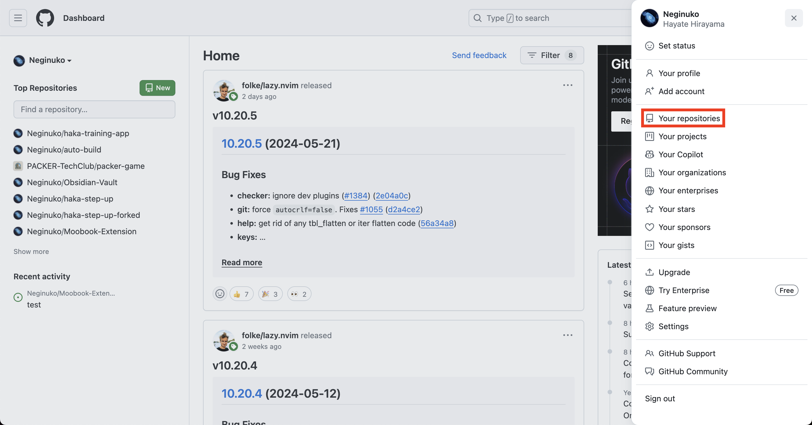

右上の自分のアイコンをクリックして、**Your repositories** をクリックします。
その後、右上の緑色の 🆕 ボタンをクリックします。

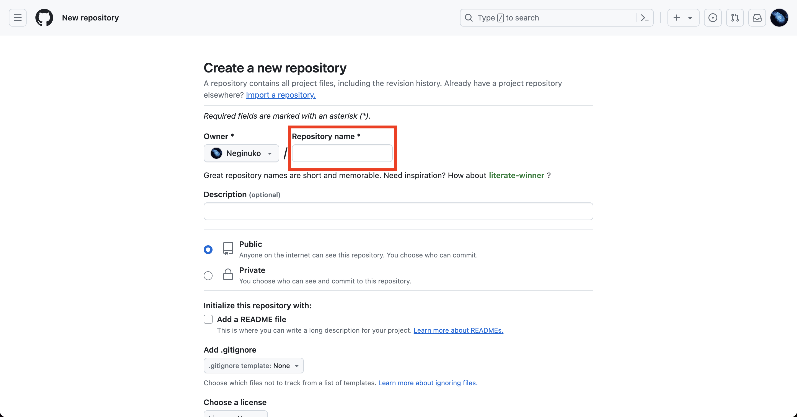

**Repository name**に適当な名前をつけます。
名前にはハイフンと英数字のみが使用できます。
書き終わったら、画面下緑色の **Create repository** ボタンを押すと、レポジトリを作成されます。

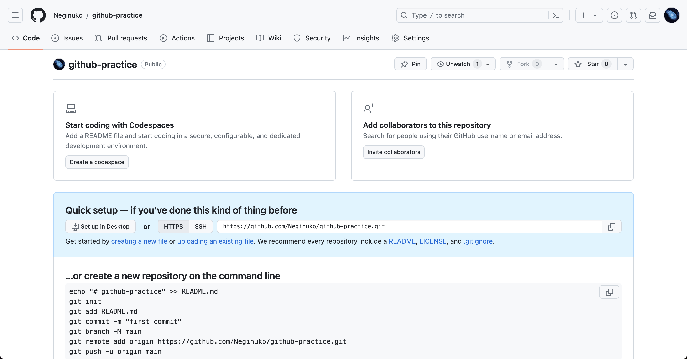

これで、Githubのレポジトリが作成できました。

では次に、先程手元のパソコンで作成したレポジトリを反映させてみます。

### Githubへの認証

その前に、手元のPCからGithubにアクセスするために、認証を行います。
今回はSSH接続での認証を行います。

まずは、ターミナルから暗号鍵のペアを作成します。
-  **macOS / Linux**
```
ssh-keygen -t ed25519 -f ~/.ssh/鍵のファイル名
```
- **Windows**
```
ssh-keygen -t ed25519 -f %homepath%/鍵のファイル名
```

鍵のファイル名はわかりやすい名前で指定します。
直前の`~/.ssh/`は変えないように。
後はEnterで作成できます。

これの公開鍵を、Githubに登録します。
まずは、公開鍵をコピーします。
- **macOS / Linux**
```
pbcopy < ~/.ssh/鍵ファイル名.pub
```
- **Windows**
```
cat %homepath%/.ssh/鍵ファイル名.pub | clip
```

作成した公開鍵のファイル名は、`鍵ファイル名.pub`のように、`.pub`修飾子がつくため注意してください。

次に、Githubに戻り右上のアイコンから **Settings** を開きます。

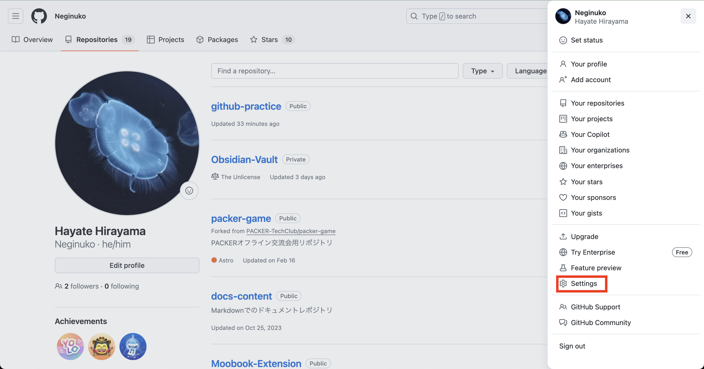

設定画面から **SSH and GPG keys** を選択します。

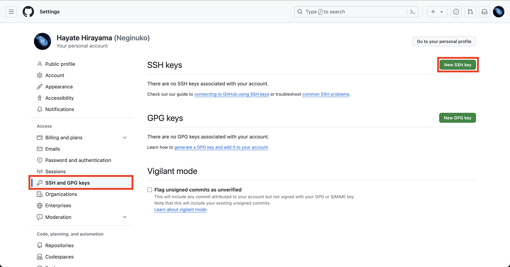

右上の緑の **New SSH Key** ボタンをクリックします。

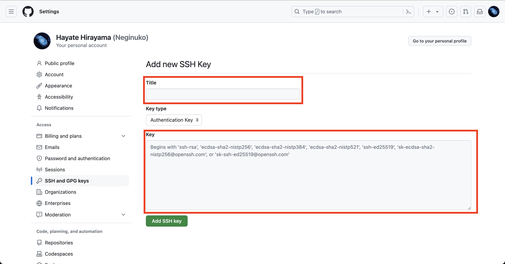

**Title** には、わかりやすい名前を設定します。
基本的にはファイル名と同じがいいと思われます。
**Key** には、先ほどコピーしたものをペーストします。

入力が終わったら、下にある緑色の **Add SSH Key** ボタンを押します。
これで設定は完了です。

### プッシュする

まずは、レポジトリの画面からURIをコピーします。
画面では、**HTTPS** になっていますが、 **SSH** を選択してコピーします。

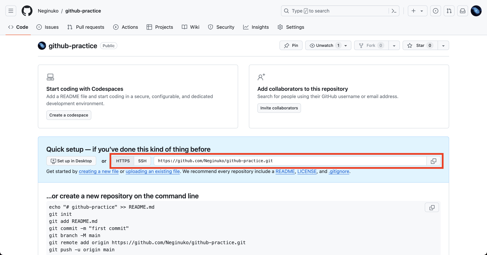


それでは、ターミナルでレポジトリに戻って、以下のコマンドを実行します。
```
git remote add origin コピーしたURIを貼り付け
```

これは、**リモートレポジトリ**名`origin`にURIを指定するコマンドです。
Githubのように、オンライン上で管理される共有用のレポジトリを、**リモートレポジトリ**といいます。
逆に、手元のPCで管理しているレポジトリを**ローカルレポジトリ**といいます。

```
git push -u origin main
```

`git push`を実行することで、リモートレポジトリにコミットした内容がアップロードされます。
このことを、**プッシュ** といいます。

逆にダウンロードすることを **プル** といいます。コマンドは以下のようになります。
```
git pull origin
```

### イシューとプルリクエスト

ここからはGithubならではの機能について説明します。
Githubでは、チーム開発を円滑にするためのいくつかの機能があります。
そのうちの一つが **イシュー** と呼ばれる機能です。

### イシュー
**イシュー**とは、簡単に言えばスレッド機能です。

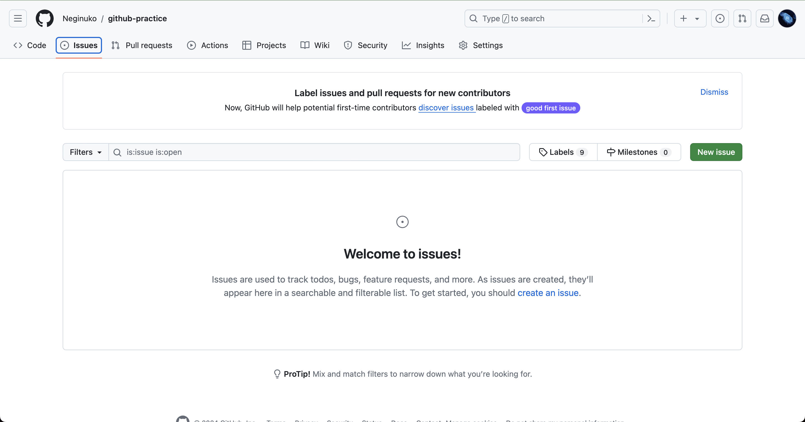
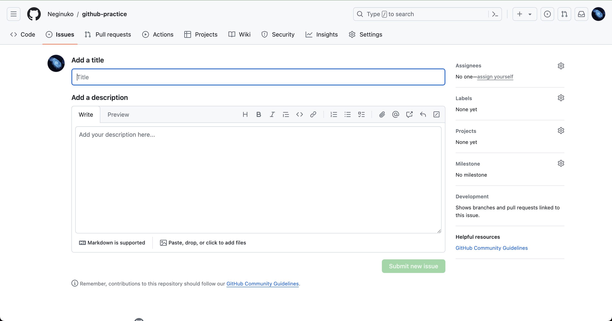

主に、不具合や特定の機能実装の際のタスク管理チケットとして利用されるケースが多いです。
本文はMarkdown形式で書くことができます。

### プルリクエスト
**プルリクエスト**とは、Github上の別のブランチから別のブランチへのマージ要求を行う機能です。
主に、チーム開発で個人が実装した作業内容を、本流のブランチへ反映させる場合に利用します。
実際に使ってみましょう。

まずは、ブランチを新しく作成します。
```
git branch dev
git checkout dev
```
そして新たにファイルを追加してコミットします。
```
echo 'new file' > devfile.txt
git add .
git commit -m "from dev-branch"
```

そしてこれを、**リモートレポジトリのdevブランチ**へプッシュします。
```
git push -u origin dev
```

Github上のレポジトリを確認すると、`dev`ブランチが追加されています。
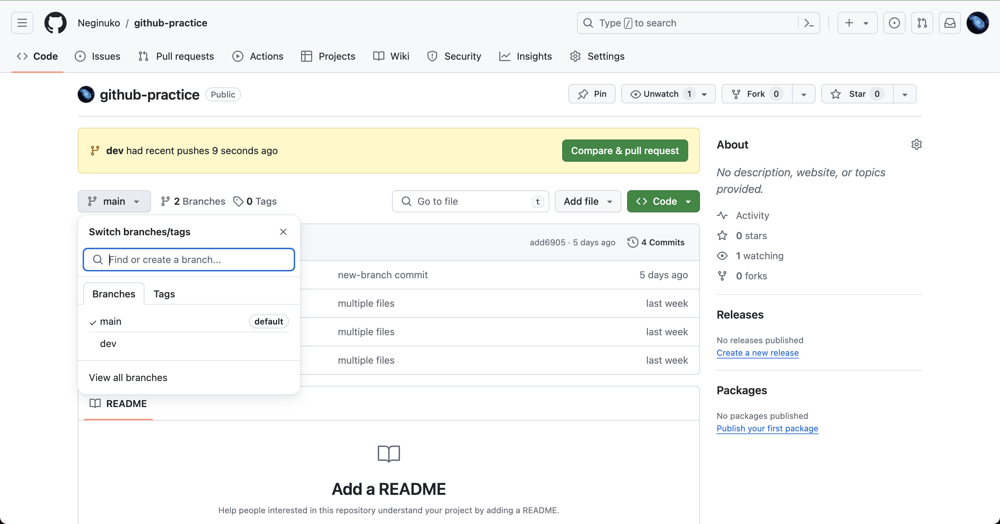

ここで、上メニュー内の **Pull requests** を開きます。
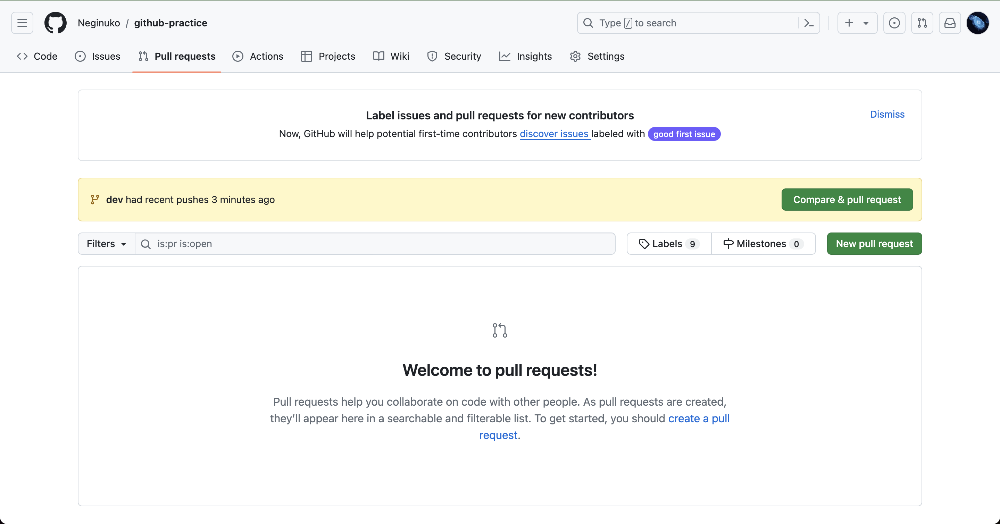
緑色の **New pull request** ボタンから、新しくプルリクエストを作成します。
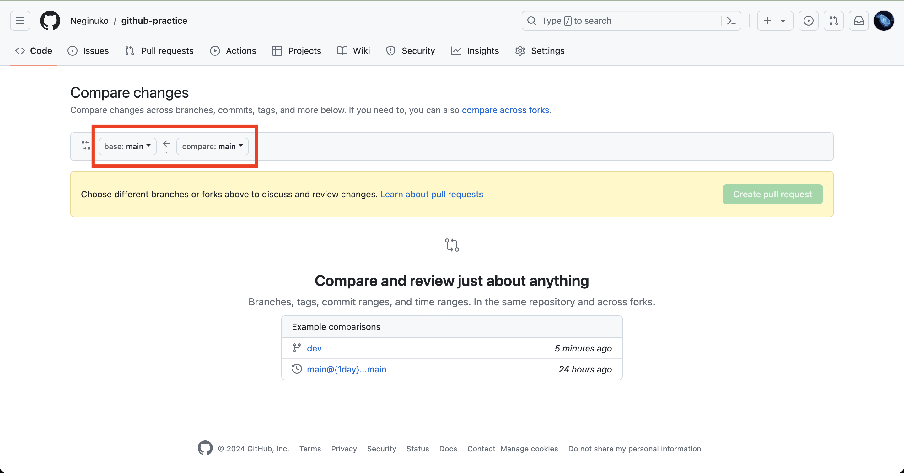

赤枠で囲まれている部分が、マージ先とマージ元を指定する箇所です。
左がマージ先なので、`main`ブランチ、右がマージ元なので、`dev`ブランチを指定します。
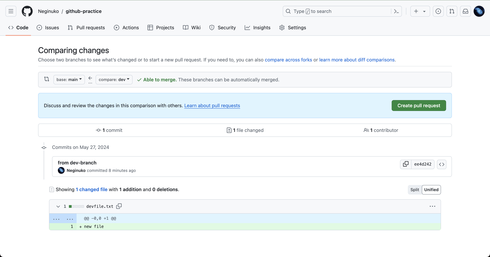
すると、画面がこのようになり、変更点が表示されます。
この状態で、右にある緑色の **Create pull request** ボタンを押すことでプルリクエストを作成することができます。

イシューのときと同様な編集画面が開き、コメントを書くことができます。
下にある緑色の **Create pull request** を押すことで、プルリクエストが発行されるようになります。

すると、このような画面に遷移します。
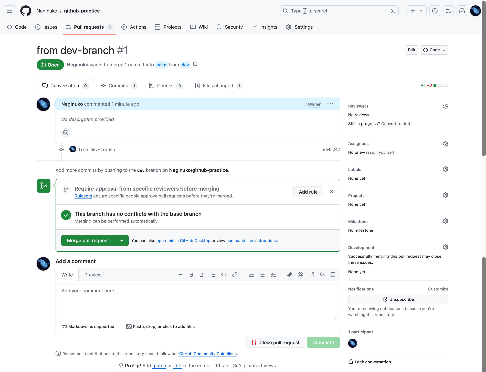
ここで、チーム開発ではコードレビューが行われ、再編集を行ったり、完了したら正式にマージが行われます。
ここでもイシューと同様にスレッド形式で会話を行うことができます。

マージを行うには、緑枠で囲われたコメントの、緑色の**Merge pull request** ボタンをクリックします。
マージ時のコミットコメントを書いて、マージが行われます。
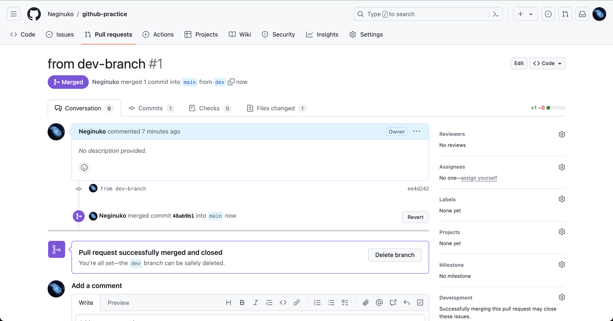
マージが行われたプルリクエストは、紫色の **Merged** という状態になります。

ここで、Githubレポジトリの中身を覗くと、`main`ブランチに編集がマージされているのが確認できます。

### クローン
最後に、Githubなどのすでにあるリモートレポジトリから、**新規に**ローカルへレポジトリを作成する方法を学びます。

適当なフォルダへ移動し、以下のコマンドを入力します。
```
git clone https://github.com/example/test.git
```
URLの部分は、Githubであればレポジトリの緑色の **Code** というボタンから取得できます。

このように、既存のリモートレポジトリからローカルレポジトリを作成することを、**クローン**などといいます。

URLの部分は、様々な形で取得が可能で、一般的なHTTPSのようなURLの他、SSH形式のURI指定であっても取得が可能です。
このときに指定した通信形式によって、プッシュやプルを行うときの通信路も決定されます。（あとから変更が可能）


## 最後に

ここまで、コマンド形式でのGitの取り扱いについて解説してきましたが、GUIベースでGitを扱う方法がいくつか存在します。

例えば、[VSCode](https://code.visualstudio.com/)では、デフォルトでGitを取り扱うことができます。
他、Githubから公開されている[Github Desktop](https://desktop.github.com/)や、汎用的なGit GUIツールである[SourceTree](https://www.sourcetreeapp.com/)も存在します。
また、Gitの公式サイト上では、[GUI版のGitツールリスト](https://git-scm.com/downloads/guis)が公開されています。

コマンドを使うことに抵抗がある人や、慣れていない人はGUIベースのツールを利用することも逃げではないと思います。
遠からず、Gitを使う機会は必ずあるため、今のうちにこのようなツールに慣れておくという手もあります。

それでは、ここまで長々とお付き合いありがとうございました。


